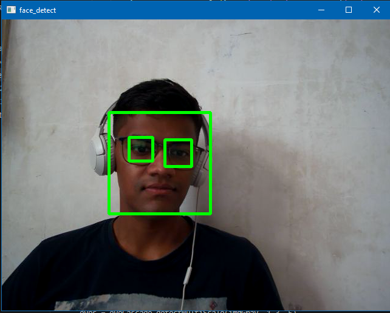

# Face_Detector

This is a simple Face & Eye Detection project made using OpenCV.
This library comes with a builtin HaaRCascade Classifier which is used in this project.
After Running the Eye&FaceDetector.py file you will see something like this.

